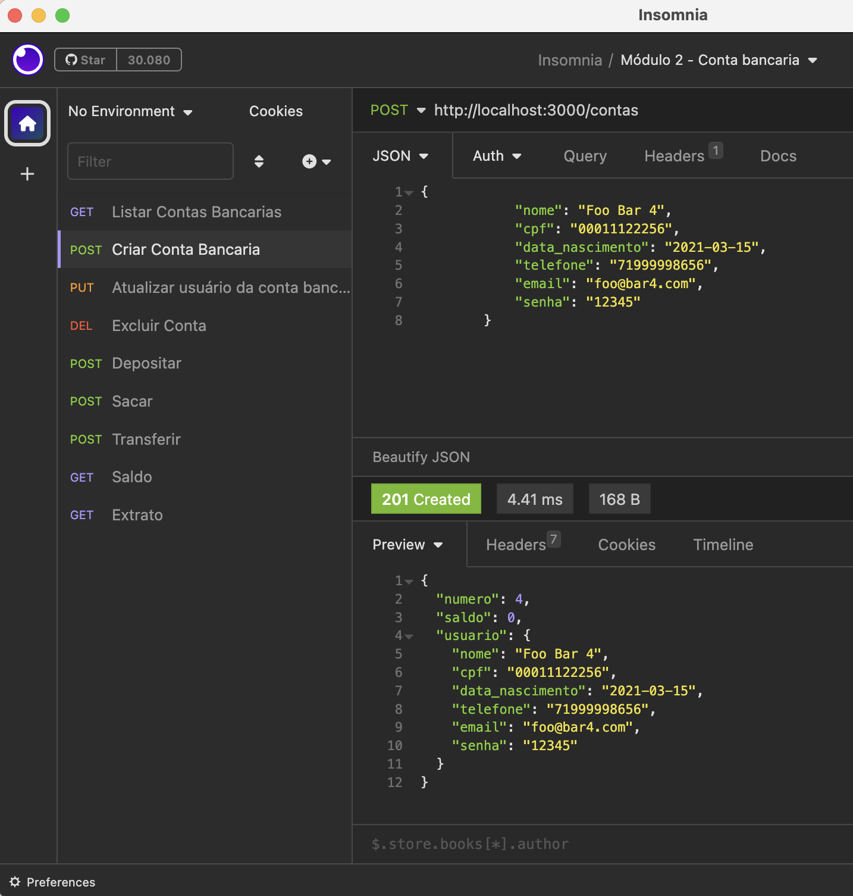
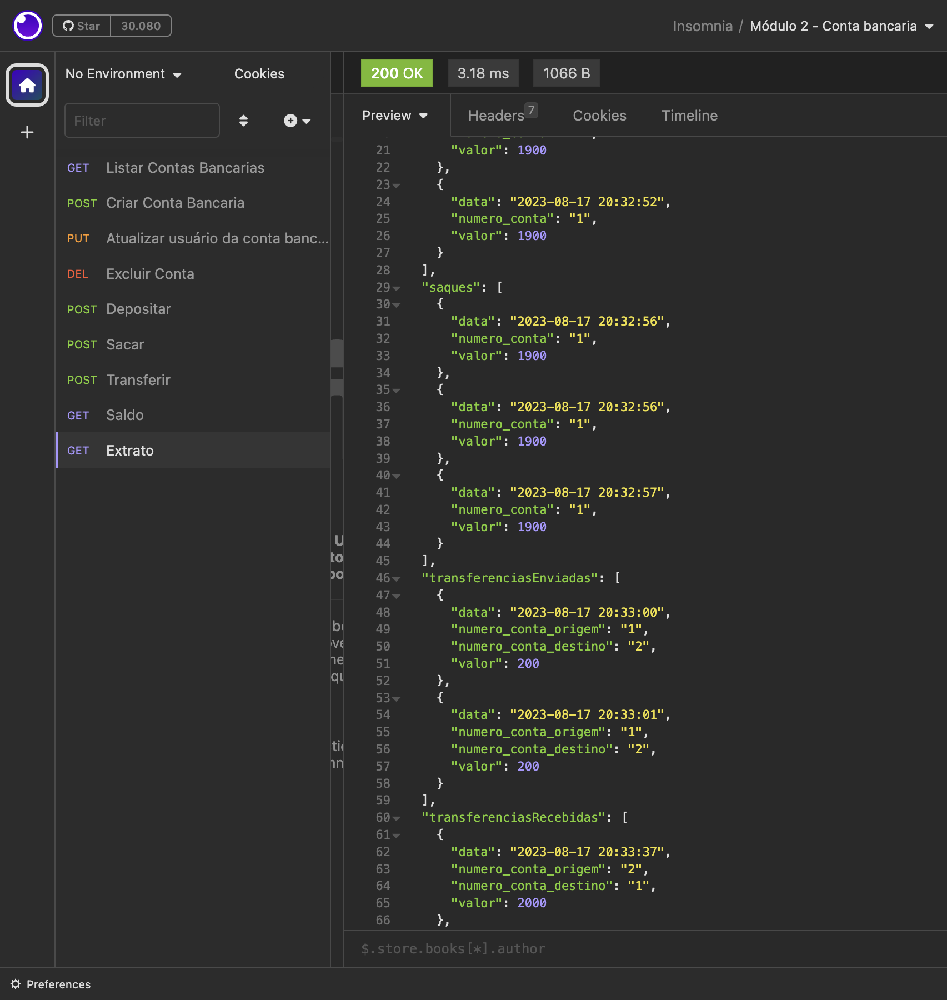

# Desafio Backend Conta Bancária

## API de Bancos 🖥️ <a href="https://cubos.academy/" target="_blank">Cubos Academy</a>

Esta é uma API simples para gerenciar contas bancárias, transações e saldos. Ela fornece endpoints para criar contas, realizar transações como depósitos, saques e transferências, e obter informações da conta.

## Nota

Esteja ciente de que este projeto pode não incluir verificações elaboradas de entrada e checagens de segurança devido aos requisitos específicos do exercício e como parte do processo de avaliação da <a href="https://cubos.academy/" target="_blank">Cubos Academy</a> durante o curso de Desenvolvimento de Software Backend. Como este projeto pode ser parte de um exercício de aprendizado, o foco pode ter sido mais em demonstrar habilidades de codificação do que em implementar um aplicativo pronto para produção.

Além disso, o banco de dados usado neste projeto é uma representação fictícia e não é escrito com funções assíncronas. Essa escolha de design está alinhada com a intenção do desafio de excluir aspectos de persistência de dados e focar nas funcionalidades principais do aplicativo.

## Instalação ⚙️

**Pré-requisitos:**

Antes de começar, você vai precisar ter instalado em sua máquina as seguintes ferramentas:
[Git](https://git-scm.com), [Node.js](https://nodejs.org/en/).
Além disto é bom ter um editor para trabalhar com o código como [VSCode](https://code.visualstudio.com/)

1. Clone este repositório para sua máquina local.
2. Navegue até o diretório do projeto.
3. Instale as dependências necessárias executando:

```sh
npm install
```

## Uso

1. Inicie o servidor:

```sh
npm run start
```

2. Acesse a API em `http://localhost:3000`.

## Endpoints

### - Listar contas bancárias

**GET** `/contas`

Esse endpoint deverá listar todas as contas bancárias existentes. Requer a senha no parâmetro URL. Exemplo: /contas?senha_banco=Cubos123Bank

### - Criar conta bancária

**POST** `/contas`

Esse endpoint deverá criar uma conta bancária, onde será gerado um número único para identificação da conta (número da conta). Requer fornecer os detalhes da conta no corpo da solicitação.

- **Requisição** - O corpo (body) deverá possuir um objeto com as seguintes propriedades (respeitando estes nomes):

  - nome
  - cpf
  - data_nascimento
  - telefone
  - email
  - senha

### - Atualizar os dados do usuário da conta bancária

**PUT** `/contas/:numeroConta/usuario`

Esse endpoint deverá atualizar apenas os dados do usuário de uma conta bancária. Requer o número da conta no parâmetro URL e as informações atualizadas no corpo da solicitação.

- **Requisição** - O corpo (body) deverá possuir um objeto com todas as seguintes propriedades (respeitando estes nomes):

  - nome
  - cpf
  - data_nascimento
  - telefone
  - email
  - senha

### - Excluir uma conta bancária

**DELETE** `/contas/:numeroConta`

Esse endpoint deve excluir uma conta bancária existente. Requer o número da conta no parâmetro URL.

### - Depósitar em uma conta bancária

**POST** `/transacoes/depositar`

Esse endpoint deverá somar o valor do depósito ao saldo de uma conta válida e registrar essa transação. Requer o número da conta e o valor do depósito no corpo da solicitação.

- **Requisição** - O corpo (body) deverá possuir um objeto com as seguintes propriedades (respeitando estes nomes):

  - numero_conta
  - valor

### - Sacar de uma conta bancária

**POST** `/transacoes/sacar`

Esse endpoint deverá realizar o saque de um valor em uma determinada conta bancária e registrar essa transação. Requer o número da conta, o valor do saque e a senha da conta no corpo da solicitação.

- **Requisição** - O corpo (body) deverá possuir um objeto com as seguintes propriedades (respeitando estes nomes):

  - numero_conta
  - valor
  - senha

### - Transferir valores entre contas bancárias

**POST** `/transacoes/transferir`

Esse endpoint deverá permitir a transferência de recursos (dinheiro) de uma conta bancária para outra e registrar essa transação. Requer os números das contas do remetente e do destinatário, o valor da transferência e a senha da conta do remetente no corpo da solicitação.

- **Requisição** - O corpo (body) deverá possuir um objeto com as seguintes propriedades (respeitando estes nomes):

  - numero_conta_origem
  - numero_conta_destino
  - valor
  - senha

### - Consultar saldo da conta bancária

**GET** `/contas/saldo`

Esse endpoint deverá retornar o saldo de uma conta bancária. Requer o número da conta e a senha da conta como parâmetros de consulta. Exemplo: /contas/saldo?numero_conta=123&senha=123

- **Requisição** - query params

  - numero_conta
  - senha

### - Emitir extrato bancário

**GET** `/contas/extrato`

Esse endpoint deverá listar as transações realizadas de uma conta específica. Requer o número da conta e a senha da conta como parâmetros de consulta. Exemplo: /contas/extrato?numero_conta=123&senha=123

- **Requisição** - query params

  - numero_conta
  - senha

## Middleware

Para garantir o acesso seguro a determinados endpoints, um middleware é implementado para verificar o acesso usando a senha do banco. Esta senha deve ser fornecida como um parâmetro de consulta.

## Visualização do Funcionamento do Projeto - Utilizando Insomnia

Listar Contas Bancárias



Extrato Bancário



### Contribuidores 💪

- Beatriz Lago

### Licença 📝

Feito com ❤️ por Beatriz Lago. 👋🏽 [Entre em contato!](https://www.linkedin.com/in/beatrizlagosb/)
